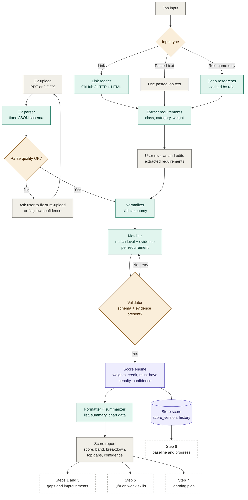

# Match Score Workflow (Step 4)

Colors: gray = user step, green = n8n (agents and orchestration), purple = FastAPI (code), orange = decision or check, dashed = downstream steps.

```mermaid
flowchart TD
  A["CV upload<br/>PDF or DOCX"]:::user --> B["CV parser<br/>fixed JSON schema"]:::n8n
  B --> C{"Parse quality OK?"}:::check
  C -- "No" --> C1["Ask user to fix or re-upload<br/>or flag low confidence"]:::user
  C1 --> A

  J["Job input"]:::user --> J1{"Input type"}:::check
  J1 -- "Link" --> L["Link reader<br/>GitHub / HTTP + HTML"]:::n8n
  J1 -- "Pasted text" --> T["Use pasted job text"]:::user
  J1 -- "Role name only" --> R["Deep researcher<br/>cached by role"]:::n8n
  L --> X
  T --> X
  R --> X
  X["Extract requirements<br/>class, category, weight"]:::n8n --> U["User reviews and edits<br/>extracted requirements"]:::user

  C -- "Yes" --> N["Normalizer<br/>skill taxonomy"]:::n8n
  U --> N
  N --> M["Matcher<br/>match level + evidence<br/>per requirement"]:::n8n
  M --> V{"Validator<br/>schema + evidence present?"}:::check
  V -- "No, retry" --> M
  V -- "Yes" --> S["Score engine<br/>weights, credit, must-have<br/>penalty, confidence"]:::api
  S --> D[("Store score<br/>score_version, history")]:::api
  S --> F["Formatter + summarizer<br/>list, summary, chart data"]:::n8n
  F --> P["Score report<br/>score, band, breakdown,<br/>top gaps, confidence"]:::user

  P --> G1["Steps 1 and 3<br/>gaps and improvements"]:::next
  P --> G2["Step 5<br/>Q/A on weak skills"]:::next
  D --> G3["Step 6<br/>baseline and progress"]:::next
  P --> G4["Step 7<br/>learning plan"]:::next

  classDef user fill:#F1EFE8,stroke:#5F5E5A,color:#2C2C2A
  classDef n8n fill:#E1F5EE,stroke:#0F6E56,color:#04342C
  classDef api fill:#EEEDFE,stroke:#534AB7,color:#26215C
  classDef check fill:#FAEEDA,stroke:#854F0B,color:#412402
  classDef next fill:#FFFFFF,stroke:#888780,stroke-dasharray:4 3,color:#2C2C2A
```
